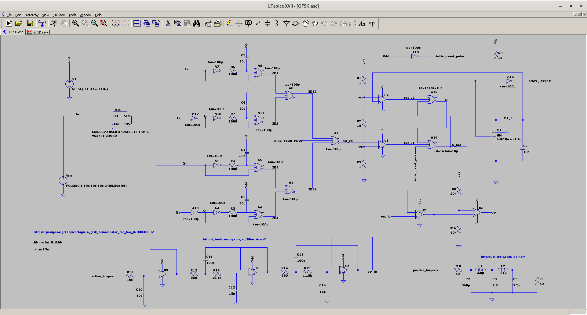

# GFSK
A simple GFSK demodulator circuit inspired by this IEEE article: [A GFSK demodulator for low-IF Bluetooth receiver](https://www.researchgate.net/publication/2982301_A_GFSK_demodulator_for_low-IF_Bluetooth_receiver)

Summary:
1. The input GFSK signal (1 Mb/s , modulation index of 0.32) is using 2MHz intermediate frequency (IF). Since this is only for simulation purpose, there is no gaussian filtering on the repeating bits of `10101010` that are generated from the `Vfm` voltage source.
2. `out_zd` is just a pulse train from the zero-crossing detector (ZD) circuit that operates on the IQ (in-phase (I) and quadrature (Q) inputs) differential `I+, I-, Q+, Q-` signals.
3. As for shape-keeping (SK) circuit, it consists of a clever mechanism of using window comparator circuit to set lower and upper voltage thresholds that helps the SR latch to work by using the mosfet `M1` together with the RC charging circuit (R9, C6).  Check the simulation waveform at the bottom to understand further.  Hint: The filtered output levels `V(out_lp)` won't reach +1V/0V.  The only way for the filtered output to reach +1V is if the pulses from the SK one-shot approach 100% duty-cycle, and the only way for it to reach 0V is if the pulses approach 0% duty cycle.
4. The demodulated signal `V(out_lp)` output variation for bit `1` and `0` is at `125mV`. So, a simple voltage comparator `U6` is added to generate baseband digital bits for downstream DSP processing work.
5. The use of 4th-order Bessel active low-pass filter circuit is due to the fact that the demodulating signal is a pulse, so a [linear phase](https://en.wikipedia.org/wiki/Bessel_filter) might be preferred.
6. The circuit now does not need .IC statements to solve pseudo transient analysis issue.  However, `initial_reset_pulse` signal is needed at the input of both A2 and A14

TODO:
1. Investigate the need/purpose of the `td` parameters of SR latch

2. Debug why the demodulator circuit does not work when passive low-pass circuit is used instead of active low-pass circuit.

3. Study the possibility of demodulating bluetooth enhanced data rate (EDR) : [pi/4-DQPSK for 2 Mb/s , while 8-DPSK is used for 3 Mb/s air data transmissions](http://download.ni.com/evaluation/rf/intro_to_bluetooth_test.pdf#page=14)

Credit: A big thank you to @Andy and @Vlad from [LTspice forum](https://groups.io/g/LTspice/topic/80343092)

